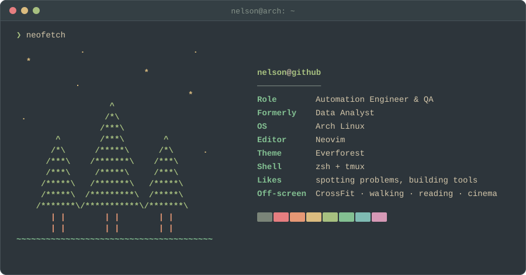

  <picture>
    <source media="(prefers-color-scheme: dark)" srcset="https://readme-typing-svg.demolab.com?font=JetBrains+Mono&weight=600&size=20&pause=1200&vCenter=true&width=520&lines=%24+whoami;Nelson+Rabasquinho;Automation+Engineer+%26+QA;I+build+tools+that+make+work+easier&color=A7C080">
    <source media="(prefers-color-scheme: light)" srcset="https://readme-typing-svg.demolab.com?font=JetBrains+Mono&weight=600&size=20&pause=1200&vCenter=true&width=520&lines=%24+whoami;Nelson+Rabasquinho;Automation+Engineer+%26+QA;I+build+tools+that+make+work+easier&color=8DA101">
    
  </picture>

  <picture>
    <source media="(prefers-color-scheme: dark)" srcset="assets/neofetch-forest-dark.svg">
    <source media="(prefers-color-scheme: light)" srcset="assets/neofetch-forest-light.svg">
    
  </picture>

